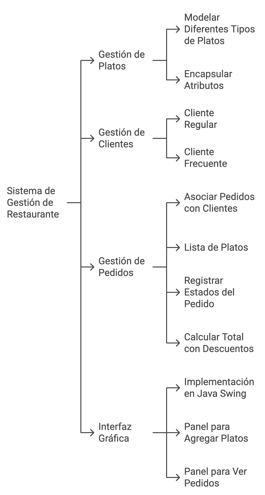

# Sistema de Gestión de Restaurante

## Descripción
Este proyecto es una aplicación básica de un sistema de gestión de restaurante implementado en Java utilizando los principios de programación orientada a objetos (POO). El sistema permite la gestión de platos, clientes y pedidos, además de incluir una interfaz gráfica sencilla para interactuar con el sistema.

---

## Características principales
1. **Gestión de Platos:**
   - Modelado de diferentes tipos de platos (`Entrada`, `PlatoPrincipal`, `Bebida`, `Postre`) utilizando herencia.
   - Atributos encapsulados como `nombre`, `precio` y `descripción`.

2. **Gestión de Clientes:**
   - Dos tipos de clientes: `ClienteRegular` (sin descuento) y `ClienteFrecuente` (descuento del 10%).
   - Uso de polimorfismo para aplicar descuentos según el tipo de cliente.

3. **Gestión de Pedidos:**
   - Cada pedido está asociado a un cliente y contiene una lista de platos.
   - Estados del pedido: "Pendiente", "En preparación" y "Entregado".
   - Cálculo del total del pedido con descuentos aplicados.

4. **Interfaz gráfica:**
   - Implementada con Java Swing.
   - Panel para agregar platos y visualizar pedidos.

---


## Estructura del proyecto
El proyecto está dividido en las siguientes clases:

1. **Platos**:
   - `Plato`: Clase abstracta base para modelar un plato.
   - `Entrada`, `PlatoPrincipal`, `Bebida`, `Postre`: Subclases que extienden `Plato`.

2. **Clientes**:
   - `Cliente`: Clase abstracta base para modelar un cliente.
   - `ClienteRegular`: Cliente sin descuentos.
   - `ClienteFrecuente`: Cliente con un descuento del 10%.

3. **Pedidos**:
   - `Pedido`: Clase para gestionar un pedido, incluyendo la lista de platos, cliente asociado y estado.

4. **Interfaz gráfica**:
   - `InterfazRestaurante`: Ventana principal para interactuar con el sistema.


---

## Requisitos del sistema
1. **Java Development Kit (JDK)**: Versión 8 o superior.
2. **IDE o editor de texto**: IntelliJ IDEA, Eclipse, VS Code, etc.

---

## Cómo compilar y ejecutar

### 1. Compilación desde la terminal:
1. Navega a la carpeta donde se encuentran los archivos `.java`:
   ```bash
   cd /ruta/del/proyecto
   ```
2. Compila todas las clases:
   ```bash
   javac *.java
   ```
3. Ejecuta la clase principal (`InterfazRestaurante`):
   ```bash
   java InterfazRestaurante
   ```

### 2. Uso de un IDE:
1. Abre el proyecto en tu IDE preferido.
2. Configura la clase `InterfazRestaurante` como la clase principal.
3. Ejecuta el proyecto directamente desde el IDE.

---

## Uso del sistema
1. **Interfaz gráfica:**
   - La ventana principal permite agregar platos y visualizar pedidos.
   - Los botones proporcionan interacciones básicas.

2. **Salida esperada en consola (si corresponde):**
   - Mensajes como "Plato agregado: Ejemplo" o "Pedidos actuales: Ejemplo".

---

## Ejemplo de prueba
El siguiente código crea un cliente, agrega platos a un pedido y calcula el total:

```java
Cliente cliente = new ClienteFrecuente("María López", "54321");
Pedido pedido = new Pedido(cliente);

Plato entrada = new Entrada("Sopa de Tomate", 12.0, "Sopa caliente con albahaca");
Plato principal = new PlatoPrincipal("Pollo Asado", 20.0, "Pollo con puré de papa");
pedido.agregarPlato(entrada);
pedido.agregarPlato(principal);

System.out.println("Cliente: " + cliente.getNombre());
System.out.println("Total con descuento: $" + pedido.calcularTotal());
```

---

## Posibles extensiones
- Agregar persistencia de datos (almacenamiento en archivos o base de datos).
- Mejorar la interfaz gráfica con más funcionalidades.
- Agregar reportes de ventas diarias.

---
